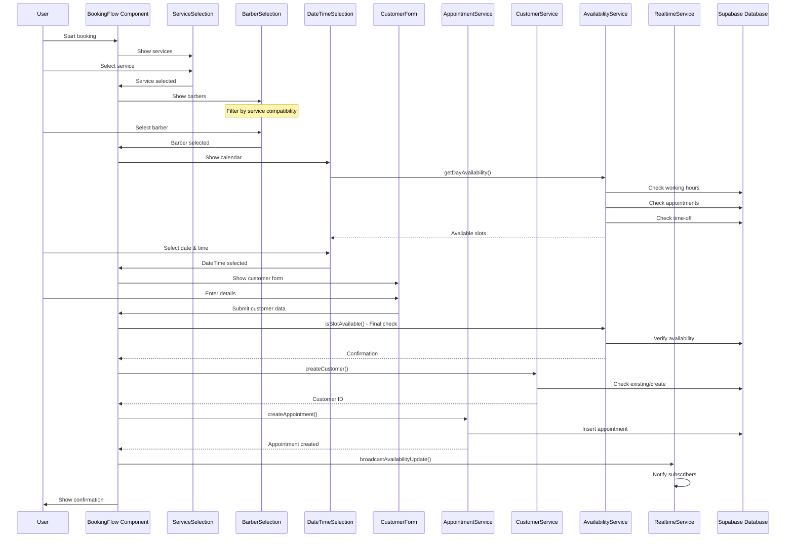
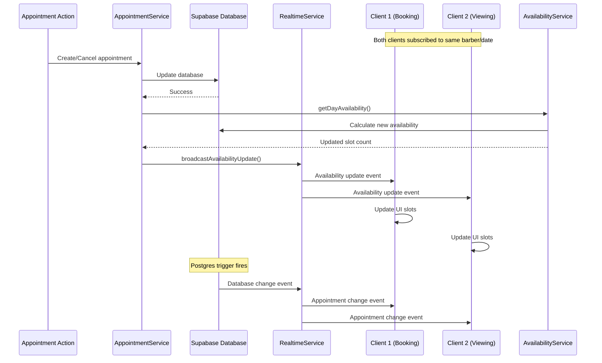
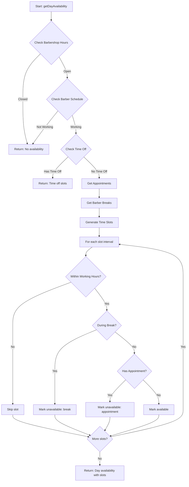

# Booking System API Documentation

## Overview

The barbershop booking system is built on a modular architecture that combines React/TypeScript frontend components with Supabase backend services. The system handles the complete booking flow from service selection through appointment confirmation, with real-time availability updates and comprehensive scheduling management.

### Architecture Components

- **Frontend**: React components with TypeScript for type safety
- **Backend**: Supabase (PostgreSQL + Real-time + Auth)
- **Services Layer**: TypeScript service classes extending BaseService
- **Real-time Updates**: Supabase Realtime for live availability
- **State Management**: React hooks and context for client state

## API Services

### AppointmentService

The core service managing appointment creation, retrieval, updates, and cancellations.

```typescript
class AppointmentService extends BaseService<Appointment>
```

#### Key Methods

##### `createAppointment(data: CreateAppointmentData): Promise<Appointment>`
Creates a new appointment with automatic validation and scheduling.

**Parameters:**
```typescript
interface CreateAppointmentData {
  barbershop_id: string;
  barber_id: string;
  customer_id: string;
  service_id: string;
  start_time: Date;
  notes?: string;
}
```

**Returns:** Created appointment object

**Process:**
1. Fetches service duration and price
2. Calculates end time
3. Verifies slot availability
4. Creates appointment record
5. Broadcasts availability update

##### `checkSlotAvailability(barberId: string, startTime: Date, endTime: Date): Promise<boolean>`
Verifies if a time slot is available by calling the database RPC function.

**Parameters:**
- `barberId`: UUID of the barber
- `startTime`: Appointment start time
- `endTime`: Appointment end time

**Returns:** Boolean indicating availability

##### `getAvailableSlots(barberId: string, date: Date, serviceId: string): Promise<TimeSlot[]>`
Generates available time slots for a specific barber and date.

**Parameters:**
- `barberId`: UUID of the barber
- `date`: Date to check availability
- `serviceId`: Service to determine duration

**Returns:**
```typescript
interface TimeSlot {
  time: string; // HH:MM format
  available: boolean;
}
```

##### `cancelAppointment(id: string, reason?: string): Promise<Appointment>`
Cancels an appointment and broadcasts availability update.

**Parameters:**
- `id`: Appointment UUID
- `reason`: Optional cancellation reason

**Process:**
1. Updates appointment status to 'cancelled'
2. Appends cancellation reason to notes
3. Broadcasts availability update for the freed slot

##### `getAppointmentsByClient(clientId: string): Promise<AppointmentWithDetails[]>`
Retrieves all appointments for a specific customer with full details.

**Returns:**
```typescript
interface AppointmentWithDetails extends Appointment {
  barber: {
    id: string;
    display_name: string;
    profile: {
      id: string;
      full_name: string;
      avatar_url: string | null;
    };
  };
  client: {
    full_name: string;
    phone: string;
    email: string | null;
  };
  service: {
    name: string;
    duration: number;
    price: number;
  };
}
```

### AvailabilityService

Manages complex availability calculations including working hours, breaks, time-off, and capacity.

```typescript
class AvailabilityService
```

#### Key Methods

##### `getDayAvailability(options): Promise<DayAvailability>`
Gets complete availability for a barber on a specific day.

**Parameters:**
```typescript
{
  barber_id: string;
  barbershop_id: string;
  date: string; // YYYY-MM-DD
  service_duration: number; // minutes
  slot_interval?: number; // default: 15 minutes
}
```

**Returns:**
```typescript
interface DayAvailability {
  date: string;
  is_available: boolean;
  slots: TimeSlot[];
  working_hours?: { start: string; end: string; };
  break_hours?: { start: string; end: string; };
}
```

**Process:**
1. Checks barbershop hours (cached)
2. Verifies barber's working schedule
3. Checks for time-off/vacations
4. Retrieves existing appointments
5. Gets barber-specific breaks
6. Generates available time slots

##### `isSlotAvailable(barberId, barbershopId, date, startTime, endTime): Promise<{available: boolean, reason?: string}>`
Comprehensive availability check for a specific time slot.

**Validation Steps:**
1. Barbershop operating hours
2. Barber working hours
3. Break time conflicts
4. Vacation/time-off conflicts
5. Existing appointment conflicts
6. Barber-specific breaks

##### `getAvailabilityHeatmap(barbershopId, startDate, endDate): Promise<AvailabilityHeatmapData[]>`
Generates heatmap data for availability visualization.

**Returns:**
```typescript
interface AvailabilityHeatmapData {
  date: string;
  hour: string;
  capacity: number;
  bookings: number;
  availability_level: 'high' | 'medium' | 'low' | 'full';
  barber_count: number;
}
```

##### `getBarberOccupancyStats(barbershopId, date): Promise<OccupancyStats[]>`
Real-time occupancy statistics for all barbers.

**Returns:**
```typescript
{
  barber_id: string;
  name: string;
  total_slots: number;
  booked_slots: number;
  occupancy_rate: number;
  working_hours: { start: string; end: string; } | null;
}
```

### BarberService

Manages barber profiles, schedules, and invitations.

```typescript
class BarberService extends BaseService<Barber>
```

#### Key Methods

##### `getBarbersByBarbershop(barbershopId: string, includeInactive = false): Promise<BarberWithProfile[]>`
Retrieves all barbers for a barbershop with full profile information.

**Returns:**
```typescript
interface BarberWithProfile extends Barber {
  profile: {
    id: string;
    full_name: string;
    email: string | null;
    phone: string | null;
    avatar_url: string | null;
  };
}
```

##### `getBarberSchedule(barberId: string, date: Date): Promise<Schedule>`
Gets the barber's schedule for a specific date, checking special dates first, then regular schedule.

##### `inviteBarberByEmail(data): Promise<void>`
Creates an email invitation for a new barber.

**Parameters:**
```typescript
{
  barbershop_id: string;
  email: string;
  display_name: string;
  message?: string | null;
}
```

##### `claimInvitation(invitationCode: string): Promise<ClaimResult>`
Claims a barber invitation using the unique code.

**Returns:**
```typescript
{
  success: boolean;
  barber_id?: string;
  barbershop_id?: string;
  invitation_type?: string;
}
```

### CustomerService

Handles customer creation, retrieval, and statistics.

```typescript
class CustomerService extends BaseService<User>
```

#### Key Methods

##### `createCustomer(customer): Promise<User>`
Creates a new customer or returns existing one based on phone number.

**Parameters:**
```typescript
{
  full_name: string;
  phone: string;
  email?: string;
}
```

**Process:**
1. Checks for existing customer by phone
2. Returns existing if found
3. Creates new customer record

##### `getCustomerWithStats(customerId: string): Promise<CustomerWithStats | null>`
Retrieves customer with appointment statistics.

**Returns:**
```typescript
interface CustomerWithStats extends User {
  total_appointments: number;
  last_appointment: Date | null;
  total_spent: number;
}
```

### RealtimeService

Manages WebSocket subscriptions for real-time updates.

```typescript
class RealtimeService
```

#### Key Methods

##### `subscribeToAppointments(options, callbacks): () => void`
Subscribes to appointment changes with filtering options.

**Parameters:**
```typescript
interface RealtimeSubscriptionOptions {
  barbershopId?: string;
  barberId?: string;
  date?: string; // YYYY-MM-DD
}

callbacks: {
  onChange?: (event: AppointmentChangeEvent) => void;
  onStatusChange?: (status: 'connected' | 'disconnected' | 'error') => void;
}
```

**Features:**
- Automatic reconnection with exponential backoff
- Filtered subscriptions for performance
- Connection status monitoring

##### `broadcastAvailabilityUpdate(update: AvailabilityUpdate): Promise<void>`
Broadcasts availability changes to subscribed clients.

**Parameters:**
```typescript
interface AvailabilityUpdate {
  barberId: string;
  date: string;
  availableSlots: number;
  timestamp: Date;
}
```

## Data Flow Diagrams

### Complete Booking Flow



### Real-time Update Flow



### Availability Calculation Flow



## Database Functions

### check_slot_availability

Validates if a time slot is available for booking.

**Parameters:**
- `p_barber_id`: UUID - Barber identifier
- `p_start_time`: TIMESTAMPTZ - Appointment start
- `p_end_time`: TIMESTAMPTZ - Appointment end
- `p_exclude_appointment_id`: UUID (optional) - Exclude specific appointment

**Returns:** BOOLEAN

**Logic:**
1. Extracts date/time components
2. Checks barber working hours and special dates
3. Validates against break times
4. Checks for appointment conflicts
5. Returns true if available

### get_available_slots

Generates all available time slots for a barber on a specific date.

**Parameters:**
- `p_barber_id`: UUID - Barber identifier
- `p_date`: DATE - Date to check
- `p_service_duration`: INTEGER - Service duration in minutes
- `p_buffer_time`: INTEGER - Buffer between appointments (default: 0)

**Returns:** Table of (slot_start TIMESTAMPTZ, slot_end TIMESTAMPTZ)

**Process:**
1. Gets working hours (regular or special)
2. Retrieves existing appointments
3. Generates slots in 15-minute increments
4. Filters out conflicts and breaks

### suggest_alternative_slots

Finds alternative slots when requested time is unavailable.

**Parameters:**
- `p_barber_id`: UUID - Barber identifier
- `p_requested_time`: TIMESTAMPTZ - Preferred time
- `p_service_duration`: INTEGER - Service duration
- `p_date_flexibility`: INTEGER - Days to search before/after (default: 3)
- `p_max_suggestions`: INTEGER - Maximum results (default: 5)

**Returns:** Table of alternative slots with date/time differences

## Real-time Events

### Subscription Events

#### appointments:*
Database change events for appointments table.

**Payload Structure:**
```typescript
{
  eventType: 'INSERT' | 'UPDATE' | 'DELETE';
  new: Appointment | null; // New record (INSERT/UPDATE)
  old: Appointment | null; // Old record (UPDATE/DELETE)
  schema: 'public';
  table: 'appointments';
}
```

**Filters:**
- `barbershop_id`: Filter by specific barbershop
- `barber_id`: Filter by specific barber
- Date filtering handled in client callback

#### availability_update (Broadcast)
Custom broadcast event for availability changes.

**Payload Structure:**
```typescript
{
  barberId: string;
  date: string; // YYYY-MM-DD
  availableSlots: number;
  timestamp: Date;
}
```

### Connection Management

The real-time service implements:
- Automatic reconnection with exponential backoff
- Maximum 5 reconnection attempts
- Connection status callbacks
- Channel cleanup on unmount

## Error Handling

### Service Layer Errors

All services extend BaseService which provides consistent error handling:

```typescript
protected handleError(error: PostgrestError): never {
  console.error(`Error in ${this.tableName}:`, error);
  throw new Error(error.message || 'Database operation failed');
}
```

### Common Error Scenarios

1. **Slot Unavailable**
   - Error: "El horario seleccionado no está disponible"
   - Cause: Slot booked between selection and confirmation
   - Solution: Re-fetch availability and show alternatives

2. **Barber Not Working**
   - Error: "El barbero no está trabajando ese día"
   - Cause: Schedule change or time-off
   - Solution: Show alternative barbers or dates

3. **Service Not Found**
   - Error: "Servicio no encontrado"
   - Cause: Service deleted or deactivated
   - Solution: Refresh service list

4. **Database Connection**
   - Error: "Database operation failed"
   - Cause: Network issues or RLS violations
   - Solution: Retry with exponential backoff

### Error Boundaries

React components are wrapped in ErrorBoundary components:

```typescript
<ErrorBoundary
  level="component"
  fallback={(props) => (
    <ErrorMessage
      title="Error title"
      message="User-friendly message"
      severity="error"
      onRetry={props.resetError}
    />
  )}
>
  <Component />
</ErrorBoundary>
```

## Example Usage

### Creating a Booking

```typescript
// 1. Create or get customer
const customer = await customerService.createCustomer({
  full_name: "John Doe",
  phone: "+1234567890",
  email: "john@example.com"
});

// 2. Check availability
const available = await availabilityService.isSlotAvailable(
  barberId,
  barbershopId,
  "2024-01-20",
  "10:00:00",
  "11:00:00"
);

if (available.available) {
  // 3. Create appointment
  const appointment = await appointmentService.createAppointment({
    barbershop_id: barbershopId,
    barber_id: barberId,
    customer_id: customer.id,
    service_id: serviceId,
    start_time: new Date("2024-01-20T10:00:00"),
    notes: "First time customer"
  });
  
  // 4. Availability update is broadcast automatically
}
```

### Subscribing to Real-time Updates

```typescript
// Subscribe to appointment changes
const unsubscribe = realtimeService.subscribeToAppointments(
  {
    barbershopId: "shop-123",
    barberId: "barber-456",
    date: "2024-01-20"
  },
  {
    onChange: (event) => {
      console.log("Appointment changed:", event);
      // Refresh UI
    },
    onStatusChange: (status) => {
      console.log("Connection status:", status);
    }
  }
);

// Clean up on unmount
useEffect(() => {
  return () => unsubscribe();
}, []);
```

### Getting Availability Heatmap

```typescript
// Get heatmap data for a week
const heatmapData = await availabilityService.getAvailabilityHeatmap(
  barbershopId,
  "2024-01-20",
  "2024-01-26"
);

// Process for visualization
const groupedByHour = heatmapData.reduce((acc, item) => {
  const hour = item.hour;
  if (!acc[hour]) acc[hour] = [];
  acc[hour].push({
    date: item.date,
    level: item.availability_level,
    percentage: (item.bookings / item.capacity) * 100
  });
  return acc;
}, {});
```

## Performance Considerations

1. **Caching**: Barbershop hours are cached for 5 minutes to reduce database queries
2. **Batch Operations**: Multi-barber availability uses batch queries
3. **Optimistic Updates**: UI updates before server confirmation
4. **Subscription Filtering**: Real-time events filtered at database level
5. **Lazy Loading**: Services load components on demand
6. **Connection Pooling**: Supabase client manages connection pool

## Security

1. **Row Level Security (RLS)**: All database operations respect RLS policies
2. **Authentication**: User must be authenticated for protected operations
3. **Input Validation**: All inputs validated at service layer
4. **SQL Injection**: Prevented by parameterized queries
5. **CORS**: Handled by Supabase Edge Functions

## Best Practices

1. Always check availability before creating appointments
2. Subscribe to real-time updates for live UI updates
3. Handle errors gracefully with user-friendly messages
4. Clean up subscriptions on component unmount
5. Use TypeScript interfaces for type safety
6. Implement retry logic for network failures
7. Cache frequently accessed data (barbershop hours)
8. Batch related operations when possible